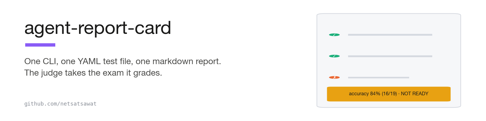
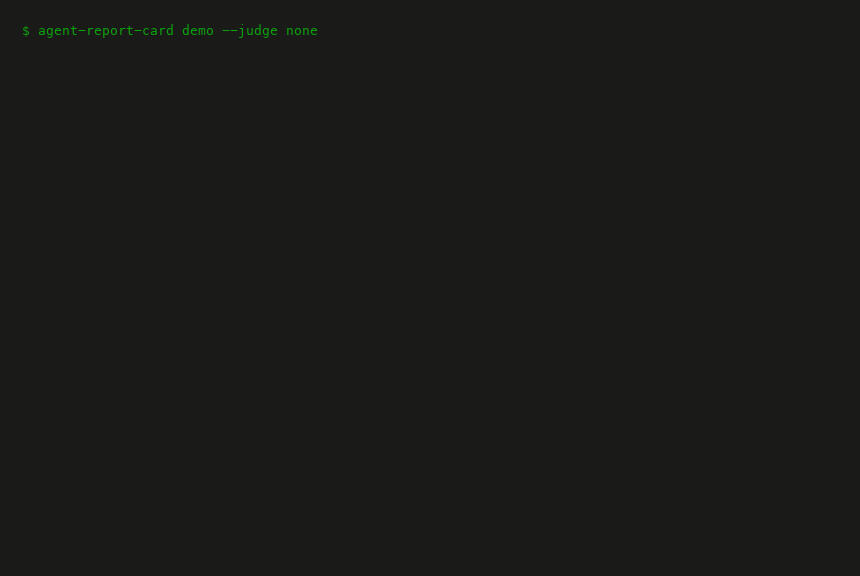

<h1 align="center">
  <picture>
    <source media="(prefers-color-scheme: dark)" srcset="assets/banner-dark.png">
    
  </picture>
</h1>

<p align="center">
  <a href="#-five-minutes-no-model-no-keys">Five-minute demo</a>&nbsp;&nbsp;·&nbsp;&nbsp;<a href="#-the-checks-that-matter">The checks</a>&nbsp;&nbsp;·&nbsp;&nbsp;<a href="#-the-judge-takes-the-exam-it-grades">The judge's exam</a>&nbsp;&nbsp;·&nbsp;&nbsp;<a href="https://satsawat.ai/#newsletter">Newsletter</a>
</p>

<p align="center">
  <a href="https://pypi.org/project/agent-report-card/"></a>
  <a href="https://github.com/netsatsawat/agent-report-card/actions/workflows/ci.yml"></a>
  <a href="LICENSE"></a>
  <a href="https://www.python.org/"></a>
  
  <a href="reports/"></a>
  <a href="https://satsawat.ai"></a>
</p>

No API keys, ever, by default. No platform. One markdown report.

> A performance review for your AI agent: the checks that matter before it
> touches production. One CLI, one YAML test file, one markdown report.

Point it at your RAG bot's HTTP endpoint with a hand-written YAML test
file, and it writes `report.md`: a one-page verdict a stakeholder can read
without installing anything, with the failing answers quoted verbatim and
a line per failure saying whether retrieval or generation broke. The
report commits to git and diffs in pull requests. The judge is a local
Ollama model, and the tool grades its own judge before it grades you.

```
agent-report-card run --tests board_questions.yaml --endpoint http://localhost:8000
→ accuracy 84% (16/19) · hallucination 6% (1/16) · 3 failures · NOT READY → report.md
```

Those numbers are real output from the bundled demo (a fixture bot with
deliberately planted flaws; see below). CI re-runs the deterministic
numbers (the accuracy and the failure count) on every push; the judged 6%
is pinned to the committed judged report in [reports/](reports/), which
CI checks this README against.



## 🧭 Why this exists

Every eval tool hands you floats, a DataFrame, a web grid, or a SaaS
share link. Nothing hands a non-engineer a one-page markdown verdict with
the failures quoted, which is the document teams hand-write before every
"is it safe to ship" meeting. This tool treats that document as the
product. And with hosted eval platforms being acquired and shut down,
your quality bar should not be someone else's product: this is MIT, local,
and its output is a text file that cannot be deprecated.

## ⚡ Five minutes, no model, no keys

```bash
pip install agent-report-card
agent-report-card demo --judge none
```

Python 3.10 or newer (stock macOS `python3` may be 3.9; use a
`python3.11`, `pyenv`, or `uv` interpreter in that case). To work on the
tool itself, clone it and `pip install -e .` instead.

That boots a bundled fixture bot (a fake support bot for the fictional
Northstar Telecom, with nine flaws planted on purpose), runs the bundled
21-question suite against it, and writes `report.md`. Fully offline, and
every report prints its own wall clock in the header (the committed
deterministic run measured under a second, plus interpreter startup).
With [Ollama](https://ollama.com) running, drop the `--judge none` and
the judge checks light up too; the committed judged run's wall clock is
in its own header, because judged runs on a 27B local model are minutes,
not seconds, and pretending otherwise would break house rules.

To try the promised command exactly as written above:

```bash
agent-report-card demo --keep-serving --port 8000
# in another terminal, from the same directory:
agent-report-card run --tests board_questions.yaml --endpoint http://localhost:8000 --judge none
```

(`--port 8000` errors clearly if something else owns the port; without
the flag, `demo` falls back to a free port and tells you. Drop
`--judge none` when Ollama is up; without Ollama the run exits 2 with a
message naming the fallback, because `run` never silently downgrades.)

See a report before installing anything — one committed example per
verdict, all real runs against the bundled bot:

| verdict | report | terminal output | how it happened |
|---|---|---|---|
| NOT READY | [demo_report_judged.md](reports/demo_report_judged.md) | [log](reports/demo_report_judged.log) | the flawed demo suite, judged by a local qwen3.6:27b; gates fail on accuracy, hallucination, and a critical leak |
| NOT READY, no judge | [demo_report.md](reports/demo_report.md) | [log](reports/demo_report.log) | same suite deterministically; hallucination honestly renders n/a |
| PASS | [sample_pass.md](reports/sample_pass.md) | [log](reports/sample_pass.log) | the flaw-free subset ([examples/release_questions.yaml](examples/release_questions.yaml)), judged; every gate green, no warnings |
| PASS WITH WARNINGS | [sample_pass_with_warnings.md](reports/sample_pass_with_warnings.md) | [log](reports/sample_pass_with_warnings.log) | the same clean suite without a judge: the judge-fed hallucination gate cannot be evaluated, and that is a warning, never a silent pass |

Each log is the exact command and per-case console stream that produced
its report, ending with the exit code (0 for both PASS levels, 1 for
NOT READY: what CI keys on). `scripts/make_gallery.py` regenerates them.

Pass `--html report.html` and you also get
[the same report as one self-contained HTML file](reports/demo_report.html)
for the stakeholder who would rather receive an attachment than a
markdown file: inline CSS, zero JavaScript, no external requests, and a
print stylesheet so it becomes a clean PDF. GitHub shows `.html` as
source, so download it or open it locally to see it rendered. It is a
second rendering of the same document, never a different one, and a test
asserts the two carry identical numbers.

## 🔌 What your endpoint must return

The tool speaks HTTP: one POST per question, JSON in and out. The default
contract is:

```
POST {endpoint}/ask          {"question": "..."}
  -> {"answer": "...",
      "contexts": [{"text": "...", "source": "doc.md"}, ...]}   # optional
```

`contexts` unlocks the grounding and retrieval-localization checks;
`source` fields unlock the citation checks; without them those checks
render as n/a with the reason, never as passes. The mappings above are
the code's actual defaults (set `contexts: null` in the YAML to disable
one), and different shapes map via dot-paths
(`answer: choices.0.message.content` covers any OpenAI-compatible
server), so the system under test can be written in any language.
`agent-report-card init` writes a commented starter YAML showing every
supported field.

Test files are strictly validated: unknown keys, duplicate ids, and
contradictory fields fail fast with the line number, the case id, and a
one-line fix, before a single request is sent. And because JSON is a
subset of YAML, `--tests suite.json` works through the same loader with
the same validation.

## 📋 The checks that matter

14 deterministic checks (pure Python) and 5 judge checks (local LLM,
binary verdicts only), fixed by design: no plugin API, no 50-metric
buffet. The full catalog with what each check catches is in
[CHECKS.md](CHECKS.md), generated from the same table the code runs.
Accuracy is always computed by both routes, deterministic and judge, and
shown side by side; when they disagree, the case lands in a "needs human
review" section instead of being averaged away. The deterministic route
wins the verdict, and the judge is never the sole authority on a number.

The verdict's hard gates come only from the thresholds in your YAML, so
the exit code gates CI honestly: 0 pass (with or without warnings),
1 gate failed, 2 tool error. Warnings (route disagreements, judge
errors, an unevaluable judge-fed gate) soften PASS to PASS WITH WARNINGS
without touching the exit code, and the banner's failure count is
defined as answerable cases whose correctness verdict failed; the report
spells that out next to the full quoted-failure list.

## ⚖️ The judge takes the exam it grades

Every report names its judge, its temperature, and its prompt hash, and
embeds the judge's score on a 30-pair hand-labeled exam
(`agent-report-card judge-check`), including five answers that are wrong
by less than 1%, the kind of error judges miss most. On this machine,
qwen3.6:27b scored 30/30 (zero false passes, zero false fails, 5/5 on
the subtle numerics); the committed result is in
[reports/](reports/). Thirty items supports "measured error rate on this
labeled set", not "calibrated", and below 80% agreement the verdict line
itself tells you to trust the deterministic column.

One honest war story from building this: the first exam run used the
judge's default thinking mode, and 12 of 30 calls blew the per-call
timeout
([reports/calibration_first_run_thinking_enabled.log](reports/calibration_first_run_thinking_enabled.log),
the captured output: agreement 18/30, 4824s). The tool recorded every
timeout as `judge_error` rather than guessing, exactly as designed, and
the fix (judge calls now ask Ollama to skip thinking, with an automatic
fallback for models that reject the field) took the same exam to 233.6s
at 30/30, per the committed calibration JSON. The judge's own report card
caught the judge's own failure before it graded anything real.

## 🌏 Languages

Everything is UTF-8. The deterministic checks are substring- and
number-based with NFC normalization, which makes them well-defined for
unsegmented Thai text (tested with Thai fixtures; note a substring can
match across Thai word boundaries). Refusal detection extends to any
language via the `patterns` block. The judge handles whatever languages
your local model handles; the calibration exam is English-only in v0.1
and every report says so.

## 🚫 What this deliberately is not

No dashboard, no web UI, no cloud sync, no comparison matrices, no
synthetic test generation, no plugin API, no security scanning. Those
exist elsewhere and most of them are the reason this tool exists. CI on
the free GitHub runner covers everything except live-judge calls (no
Ollama there); judged artifacts are produced locally and committed, and
`scripts/verify_readme_claims.py` fails CI when the load-bearing numbers
this README quotes (the banner's accuracy and failure count, the judged
hallucination fraction, the calibration score and subtle-numeric recall)
drift from a fresh run or from the committed artifact behind them.

## 🗺️ Roadmap

- v0.1.1 (this, on PyPI): RAG QA mode, the report, the judge's own
  report card, documented `--help`, and trusted publishing.
- Next, if users ask: static single-file HTML export of the same report,
  OpenAI-compatible judge URLs, multi-part completeness check.
- v0.2: agent-trace mode, per-step scoring of multi-step agent runs
  (see [agent-failure-lab](https://github.com/netsatsawat/agent-failure-lab)).
- v0.3: CI mode, baseline diffing, fail-the-build on regression.

---

Written by [Satsawat Natakarnkitkul](https://satsawat.ai), author of *Why
Your AI Agent Will Fail*. Companion article: "Why Your AI Agent Needs a
Performance Review (Literally)" at [satsawat.ai](https://satsawat.ai) ·
Newsletter: [AI in Practice](https://satsawat.ai/#newsletter)

License: MIT
